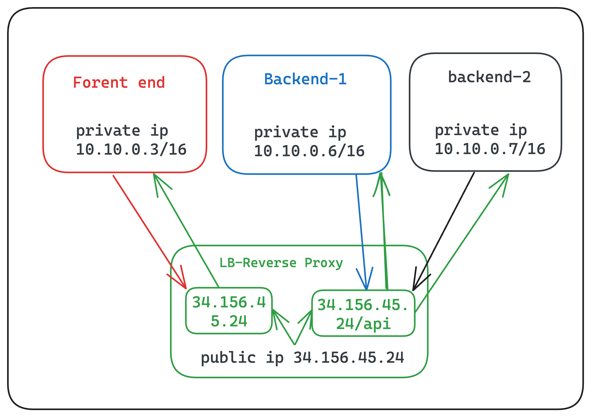

## Deploy a full stack application in GPC where Load Balancing and a reverse proxy are used to serve the application.

    

# In this project we are using GPC for the cloud server. 
Create 4 VMs:
1. Load balancing and reverse proxy
2. Front Server
3. Backend Server-1
4. Backend Server-2

## 1. Load balancing and reverse proxy:
Load balancing is a technique used to distribute incoming traffic across multiple servers or resources. It plays a pivotal role in ensuring high availability, optimal resource utilization, and improved response times. When your application experiences increased traffic, a load balancer ensures that requests are evenly distributed among various servers, preventing any single server from becoming overwhelmed.

A reverse proxy serves as an intermediary between client requests and the application servers. It receives requests from clients, forwards them to the appropriate server, and sends back the response to the client. Reverse proxies offer several advantages, including security, load distribution, and caching.

## 2. Forent Server:
In this VM, we are trying to install our front-end application. Based on our we need to install a library or framework. Here I am installing react-js for front end application. (forentend.sh) Here write all required commands for installing react js in a VM.

## 3. Backend Server-1 and 4. Backend Server-2:
For the backend servers one and two doing the same thing. (backend-1.sh) and (backend-2.sh) both shells are some, only their IP address are different because of different VMs.
For me, I am installing the node-js Express backend server for the testing process. Note in build in the nginx server using round robin algorithm to forwarding the request.

